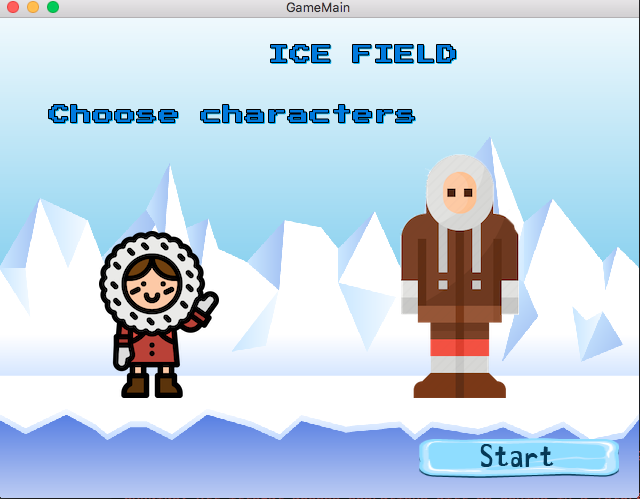

# IceField
BME project lab 
Icefield

In the game the players control (3 or more) different figures on an icefield surrounded by sea where they have to survive. The figures can be either eskimos or polar explorers, and they operate in rounds.

The icefield consists of tabular icebergs. There are stable icebergs that can hold any number of figures, and there are unstable icebergs that capsize when too many figures try to stand on them, in which case every figure on the iceberg falls into the water. The icebergs are covered in different amounts of snow at the beginning.

In some of the icebergs objects can be found: shovel, rope, diving suit, food, etc. These frozen in objects can only be seen and retrieved, when the iceberg is clean of snow. Between the icebergs there might be holes covered with snow. If a figure steps on such a hole, they will slip into the water. Figures in the water can only survive if either they wear a diving suit or a nearby figure helps with a rope.

Each player has 4 moves in a round. Such moves include removing a unit of snow from the iceberg the figure stands on, stepping onto a neighbouring iceberg, retrieving an object, etc. Having a shovel it only takes a single move to remove two units of snow.

There might be blizzards during the game. A blizzard covers some of the icebergs with fresh show. If caught in a blizzard the figures lose a unit of body heat. The eskimos have 5, the explorers 4 body heat units at the beginning. Eating a unit of food increases the body heat by one, and counts as a move.

The figures travel from iceberg to iceberg according to their skills. The explorer can check how many figures a neighbouring iceberg can support (holes support none). The eskimos can build igloos that give shelter from the blizzards.  Applying a skill is considered a move.

The aim of the game is to find and collect all parts of a flare gun (gun, flare, charge), which are also frozen into the ice. When collected, the parts have to be brought onto the same iceberg and all figures have to stand on that iceberg. In that case the gun can be fired and the players are rescued. If anybody dies (body heat reaches zero or the figure drowns) during the game, the players lose.
